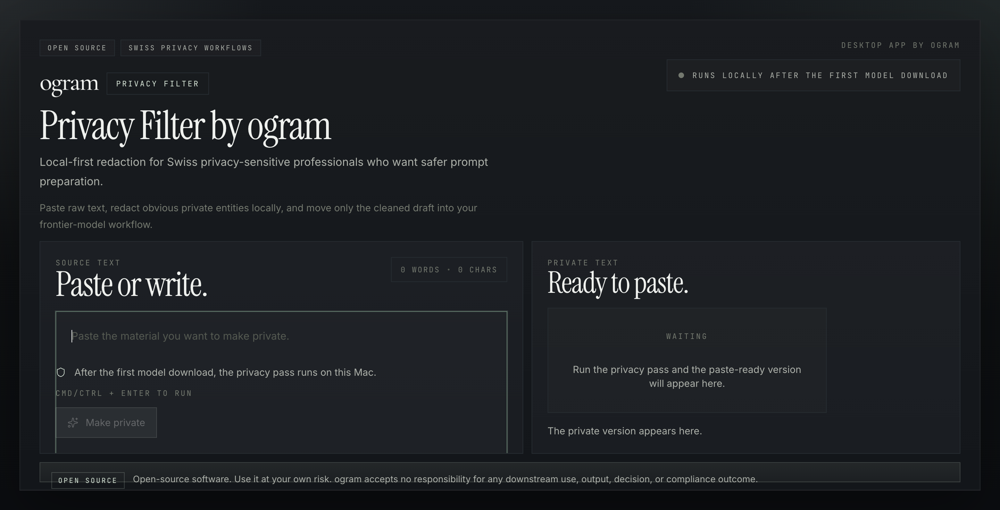

# Privacy Filter by ogram

Open-source, local-first macOS redaction for Swiss privacy-sensitive professionals who want safer prompt preparation before using frontier models.

[Project site](https://self-tech-labs.github.io/privacy-filter/) · [Releases](https://github.com/self-tech-labs/privacy-filter/releases) · [Privacy notes](docs/PRIVACY.md) · [Security policy](SECURITY.md)



## Why this exists

`Privacy Filter` helps reduce obvious exposure when a lawyer, doctor, or other specialist wants help from a frontier model but should not start by pasting raw material into a hosted system.

The workflow is deliberately narrow:

1. Paste a working draft into the desktop app.
2. Run the local privacy pass.
3. Move the cleaned version into ChatGPT or another model workflow.

It is built for v1 simplicity, not kitchen-sink document management.

## Who it is for

- Swiss law firms preparing client-facing drafts, exhibits, or notes.
- Medical practices preparing structured summaries or administrative drafts.
- Any specialist handling private data who wants a local-first first pass before using powerful hosted models.

## What it does

- Runs the privacy filter locally after the first model download.
- Replaces detected entities with typed placeholders such as `<PRIVATE_PERSON>` and `<PRIVATE_DATE>`.
- Keeps the interface paste-only so the workflow stays predictable and easy to audit.
- Ships as a Tauri desktop app for macOS.

## Model reference

This project uses OpenAI's [`openai/privacy-filter`](https://huggingface.co/openai/privacy-filter) model from Hugging Face as its local privacy-detection engine.

According to the Hugging Face model page, `openai/privacy-filter` is a token-classification model for PII detection and masking. In this project, we load that model through `@huggingface/transformers`, run it locally after the first model download, detect spans such as names, emails, phone numbers, dates, addresses, URLs, account numbers, and secrets, then replace those spans with typed placeholders before the user copies the cleaned text into ChatGPT or another downstream model workflow.

## Privacy model

- The privacy pass itself runs on-device after the initial model download.
- The first model download can require network access.
- Cached model files are stored locally for later runs.
- The tool lowers obvious exposure risk, but it does not guarantee compliance, secrecy, or completeness.

Read the full model and network notes in [docs/PRIVACY.md](docs/PRIVACY.md).

## Legal note

This is open-source software released under the [MIT License](LICENSE). Use it at your own risk. ogram accepts no responsibility for any downstream use, output, decision, or compliance outcome.

## Install

The easiest way to try the app is from the [GitHub Releases page](https://github.com/self-tech-labs/privacy-filter/releases).

For the initial open-source release, some technical bundle identifiers and artifact names still use the existing `ogram private` naming under the hood. The user-facing app copy is `Privacy Filter by ogram`.

## Local development

```bash
npm install
npm run tauri:dev
```

Useful commands:

```bash
npm test
npm run build
npm run site:build
npm run check
```

## Project structure

- `src/` desktop app frontend
- `src-tauri/` Tauri shell and native packaging config
- `site/` GitHub Pages landing site
- `docs/` release and privacy documentation

## Release workflow

Release notes, updater signing, and notarization inputs live in [docs/RELEASE.md](docs/RELEASE.md).

Main commands:

```bash
npm run release:mac:app
npm run release:mac:dmg
npm run release:mac:all
```

## Contributing

Start with [CONTRIBUTING.md](CONTRIBUTING.md). Please read the [Code of Conduct](CODE_OF_CONDUCT.md) and [Security Policy](SECURITY.md) before opening contributions or reports.
